I noticed that many people spend quite some time inspecting the books on a person's shelf. I am no exception. A bookshelf is a great opportunity to find out what someone is interested in and can be a useful conversation starter. So with the following collection, I would like to invite you to browse through my favourite books.

(_Click on the images to get more information on each book_)

Back to [annikatjuka.com](https://annikatjuka.github.io/)

# Language and Mind

| | | |
|---|---|---|
|  |  | |
| [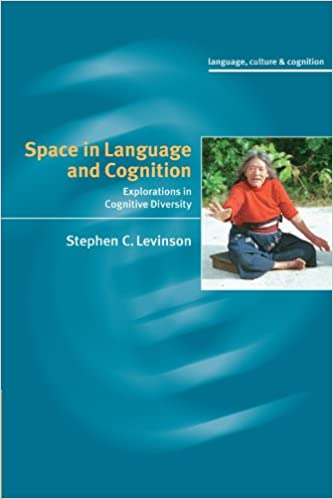](https://g.co/kgs/hXt3n2) |  | [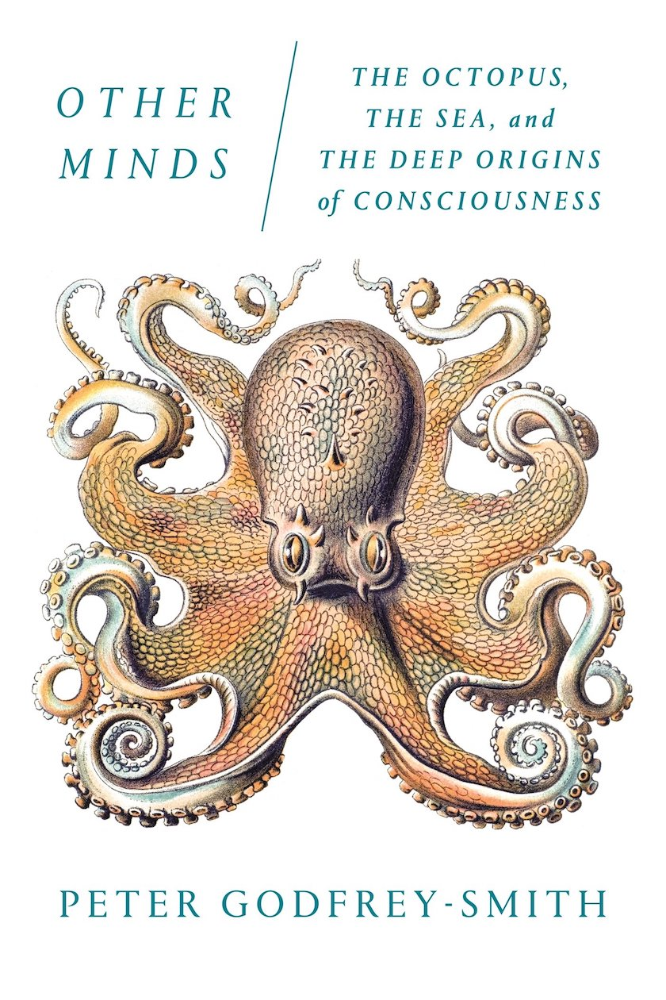](https://g.co/kgs/Hx9Dqr) |
| [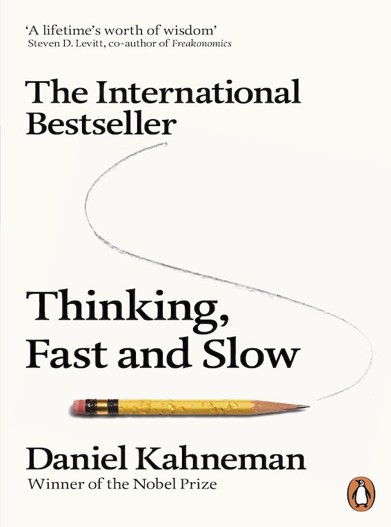](https://g.co/kgs/SSbsxs) |  |  |
|  |  |  |

# Linguistic Theory

| | | |
|---|---|---|
|  |  | |
|  | [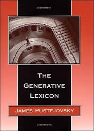](https://g.co/kgs/rgUZRf) |  |
|  |  |  |

# Theoretical Works

| | | |
|---|---|---|
| [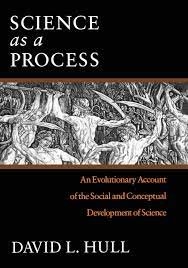](https://g.co/kgs/tkgbFV) |  |  |

# Science as an Adventure

| | | |
|---|---|---|
|  | | |
| [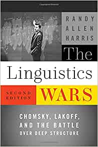](https://g.co/kgs/UxWDW5) | [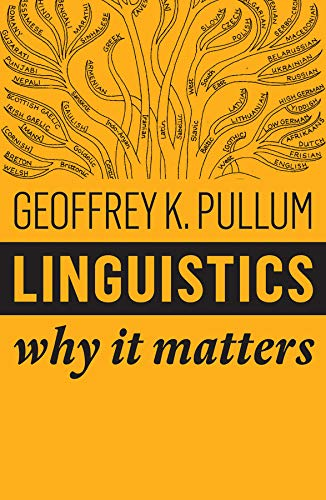](https://g.co/kgs/rQf5go) |  |
|  | [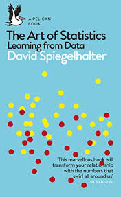](https://g.co/kgs/9qPyCL) | [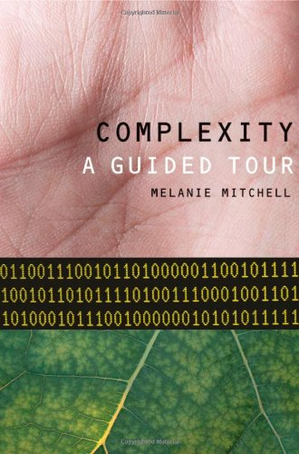](https://g.co/kgs/KZCjYM) |
| [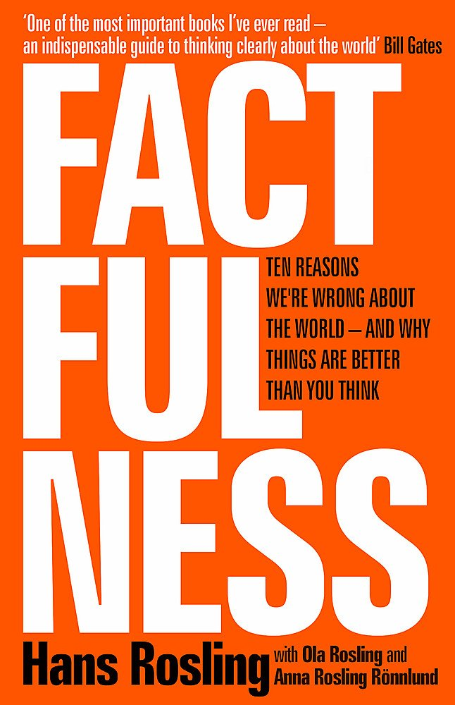](https://g.co/kgs/AQdmWN) | [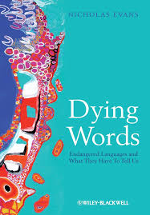](https://g.co/kgs/FQZM2N) |  | 
|  |  | [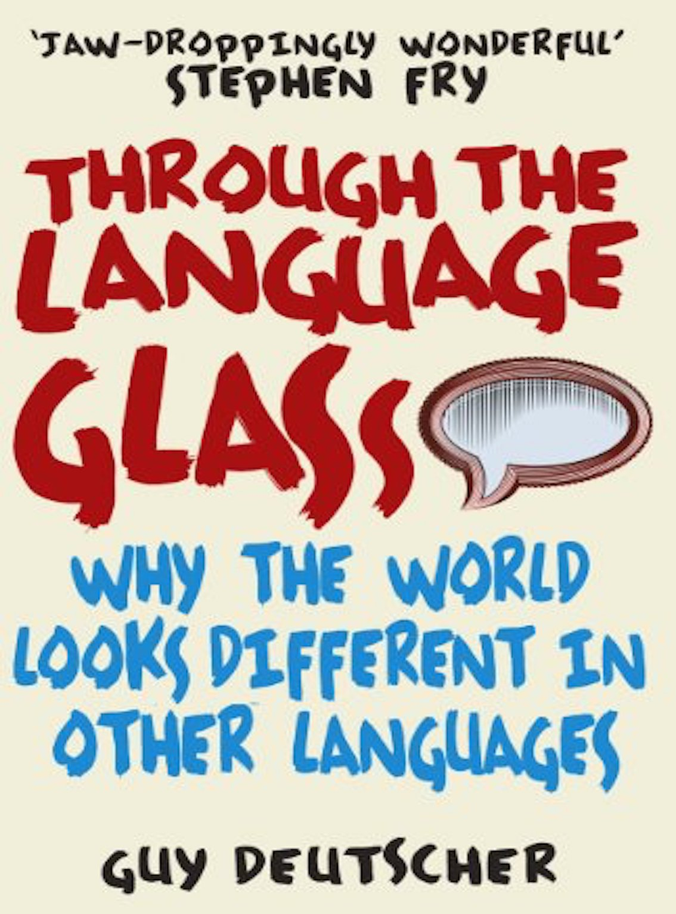](https://g.co/kgs/GiMA4H) |
|  |  | [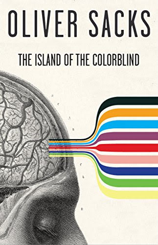](https://g.co/kgs/U5JgkH) |
| [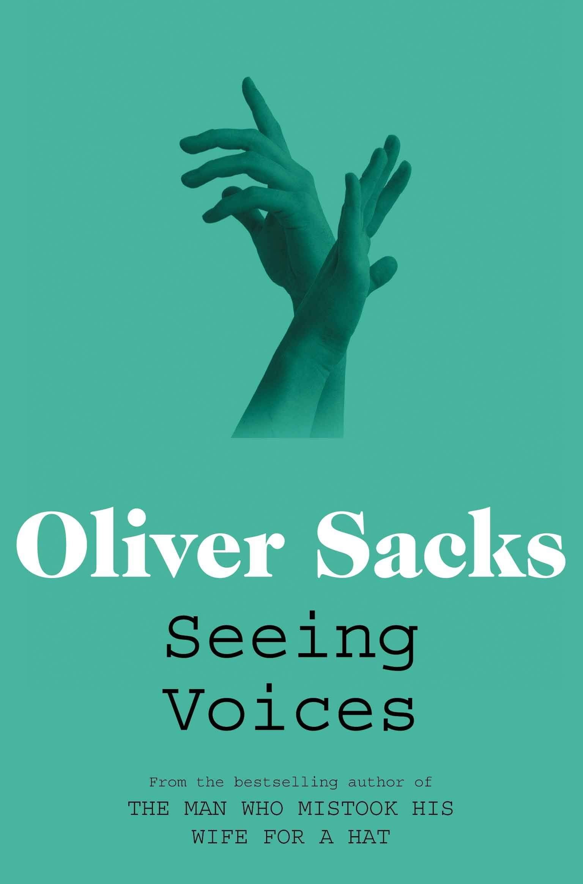](https://g.co/kgs/Bpb6Dy) |  |  |

# Training for Research and Teaching

| | | |
|---|---|---|
|  |  | |
|  | [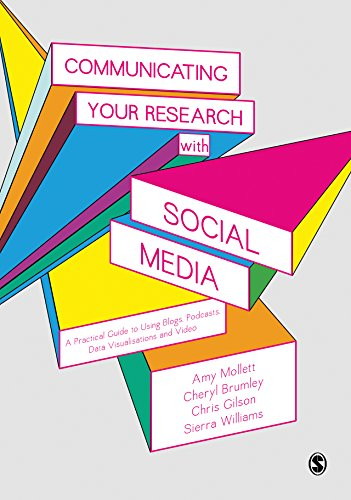](https://g.co/kgs/yanvzH) | [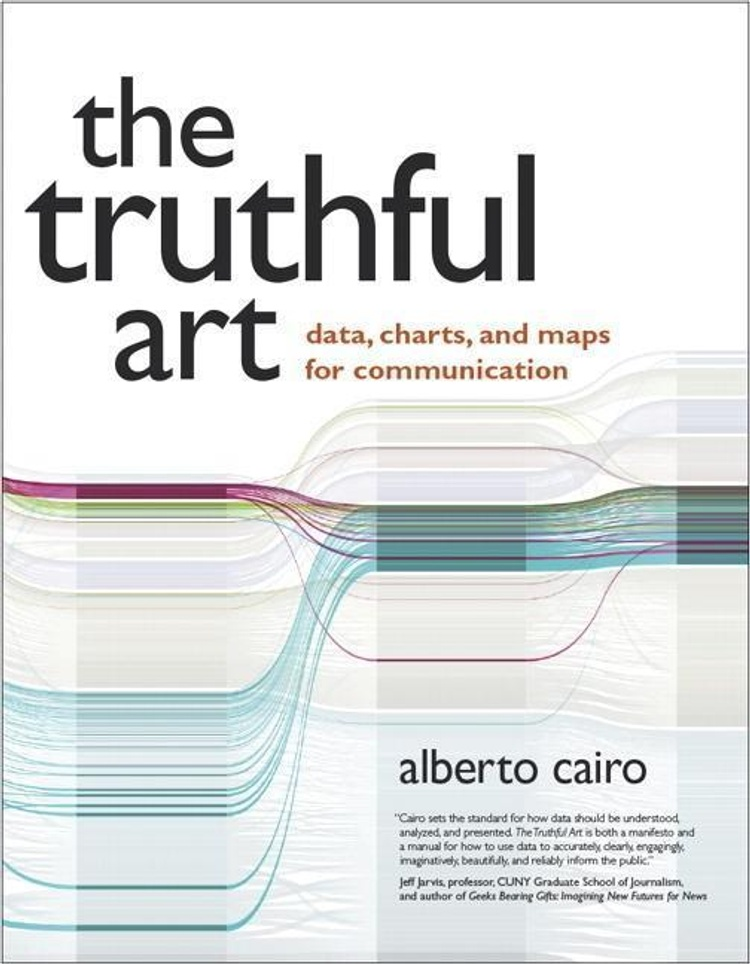](https://g.co/kgs/DEuz58) |
|  |  | [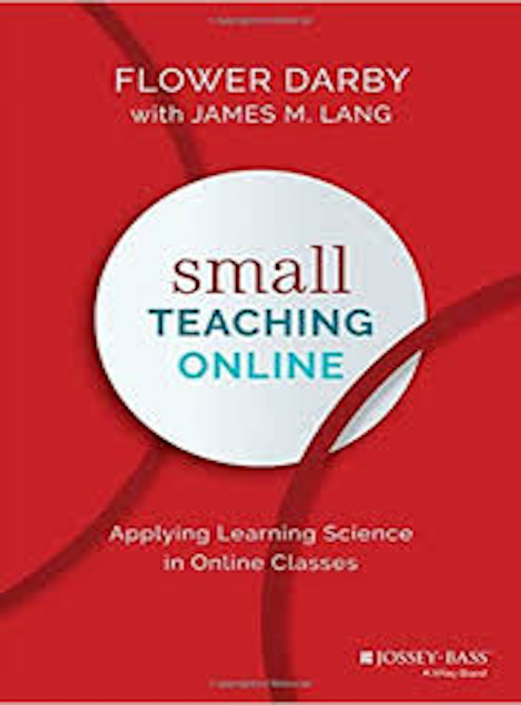](https://g.co/kgs/7J6Rqh) |
|  |  |  |

# Communication

| | | |
|---|---|---|
| [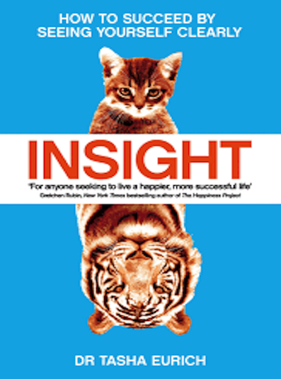](https://g.co/kgs/zQ5F28) | | | 
| [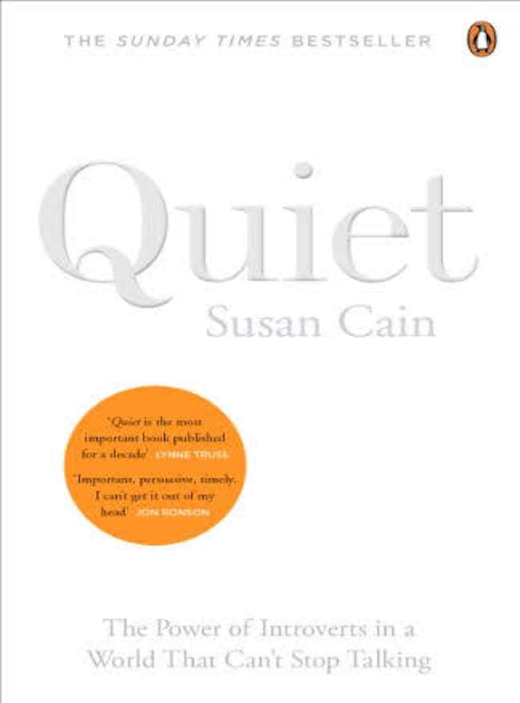](https://g.co/kgs/G7dkHE) |  |  |
|  |  |  |

# Inspiration

| | | |
|---|---|---|
|  |  |  |
|  |  |  | 

