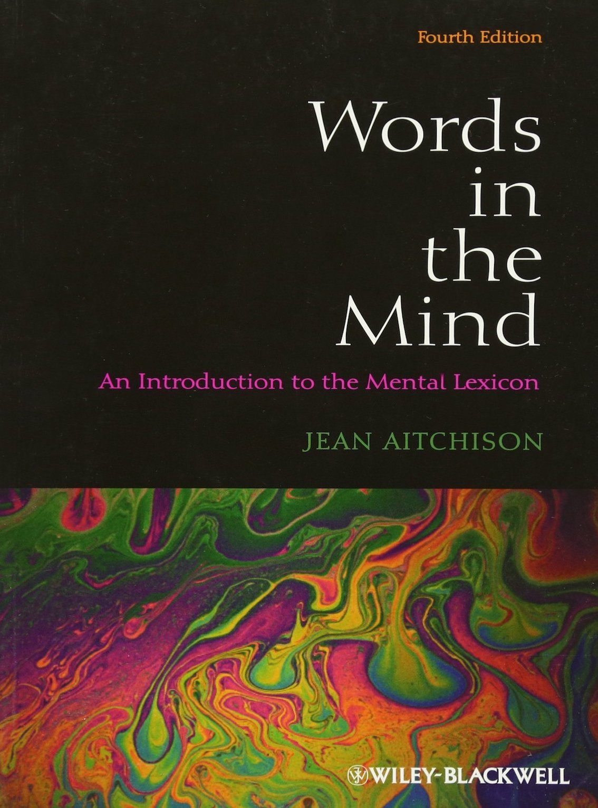
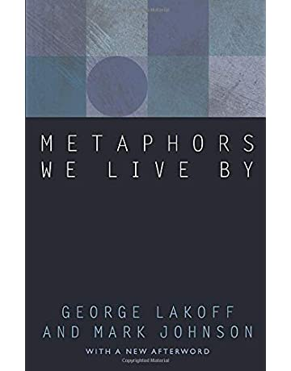
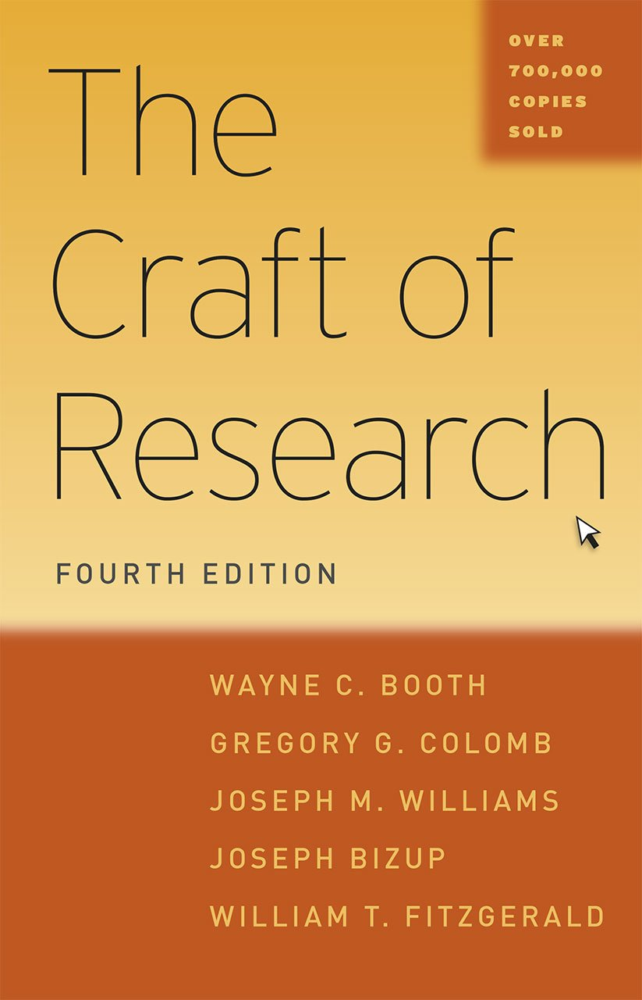

I noticed that many people spend quite some time inspecting the books on a person's shelf. I am no exception. A bookshelf is a great opportunity to find out what someone is interested in and can be a useful conversation starter. So with the following collection, I would like to invite you to browse through my favourite books.

(_Click on the images to get more information on each book_)

Back to [annikatjuka.com](https://annikatjuka.github.io/)

# Language and Mind

| | | |
|---|---|---|
|  |  | |
|  |  |  |
|  |  |  |

# Linguistic Theory

| | | |
|---|---|---|
|  | | |
|  |  |  |
|  |  |  |

# Theoretical Works

| | | |
|---|---|---|
|  |  |  |

# Science as an Adventure

| | | |
|---|---|---|
|  |  | |
|  |  |  |
|  |  |  | 
|  |  |  |
|  |  |  |
|  |  |  |

# Training for Research and Teaching

| | | |
|---|---|---|
|  | | |
|  |  |  |
|  |  |  |
|  |  |  |

# Communication

| | | |
|---|---|---|
|  | | | 
|  |  |  |
|  |  |  |

# Inspiration

| | | |
|---|---|---|
|  |  |  |
|  |  |  | 

